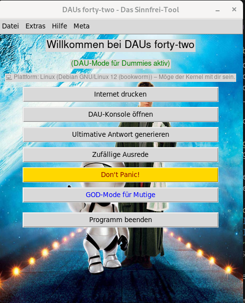
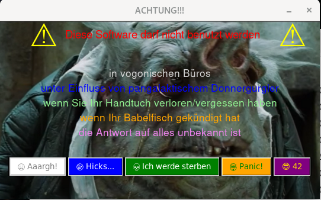

# DAUs forty-two - Das Sinnfrei-Tool

 

Willkommen bei **DAUs forty-two**, dem ultimativen Tool, das absolut keinen produktiven Zweck erfüllt – und stolz darauf ist! 🚀
Dieses Projekt ist eine humorvolle Python-Anwendung mit Tkinter-GUI, die darauf ausgelegt ist, ahnungslose Benutzer (DAUs) und alle, die einen Sinn für digitalen Unsinn haben, zu unterhalten.

Es dient gleichzeitig als (hoffentlich) unterhaltsames Lernprojekt für Python, Tkinter und die Strukturierung kleinerer Desktop-Anwendungen.

## Features (oder so ähnlich)

*   **Internet drucken:** Startet den (simulierten) Ausdruck des gesamten Internets. Papierstau vorprogrammiert!
*   **DAU-Konsole:** Erhalte "hilfreiche" Ratschläge, wenn du mal wieder nicht weiterweißt.
*   **Ultimative Antwort:** Generiert tiefsinnige Antworten auf Fragen, die nie gestellt wurden (Spoiler: oft ist es 42).
*   **Zufällige Ausreden:** Die perfekte Ausrede für jede IT-Panne – der Hamster war's!
*   **Don't Panic Button:** Ein Knopf für alle Fälle, inspiriert von einem gewissen galaktischen Reiseführer.
*   **GOD-Mode:** Für die ganz Mutigen, die glauben, sie wüssten, was sie tun. (Spoiler: Tun sie nicht.)
*   **Fake-Systemoptimierung:** "Optimiert" dein System auf eine Weise, die dich zum Lachen (oder Weinen) bringt.
*   **Sinnfreie Menüs:** Voller Optionen, die entweder nichts tun oder dich auf humorvolle Weise in die Irre führen.
*   **Easter Eggs:** Wer suchet, der findet... vielleicht. 😉
*   **Soundeffekte:** Weil sinnfreie Aktionen besser klingen!
*   **Humorvolle Dialoge:** Inklusive "Beipackzettel" und "Warnhinweisen".

## Warum dieses Projekt?

1.  **Lernen & Lehren:** Ursprünglich als persönliches Projekt gestartet, um Python und Tkinter zu vertiefen. Jetzt soll es anderen als (hoffentlich) amüsantes Beispiel dienen.
2.  **Spaß am Unsinn:** Weil nicht jede Software die Welt verändern muss. Manchmal reicht es, wenn sie ein Schmunzeln hervorruft.
3.  **Eine Hommage:** An alle DAUs da draußen, an Douglas Adams' "Per Anhalter durch die Galaxis" und an die Absurditäten der IT-Welt.

## Installation

Da es sich um ein Lernprojekt handelt, ist die "Installation" eher ein Ausführen aus den Quellen.

1.  **Python:** Stelle sicher, dass Python 3.x installiert ist.
2.  **Abhängigkeiten:**
    *   `tkinter` (ist meistens bei Python dabei)
    *   `Pillow` (PIL Fork) für Bildverarbeitung: `pip install Pillow`
    *   Auf Linux-Systemen für Sound: `aplay` (Teil von `alsa-utils`) sollte verfügbar sein.
    *   Auf macOS für Sound: `afplay` ist standardmäßig vorhanden.
3.  **Repository klonen:**
    ```bash
    git clone https://github.com/ErNuWieda/DAUs42.oop.git
    cd DAUs42.oop
    ```
4.  **Starten:**
    ```bash
    python main.py
    ```

## Benutzung

Starte die `main.py`. Klicke auf alles, was klickbar aussieht. Erwarte nichts Produktives. Hab Spaß!
Drücke **NICHT** den roten Knopf... oder vielleicht doch?





## Lizenz

Dieses Projekt steht unter der GNU General Public License v3.0.
Kurz gesagt: Du darfst es verwenden, verändern und weitergeben, solange du die gleichen Freiheiten gewährst und den Quellcode offenlegst.

## Mitmachen (Contributing)

Da dies auch ein Lernprojekt ist, sind Ideen, Vorschläge und Verbesserungen herzlich willkommen!

*   Du hast eine Idee für eine neue sinnfreie Funktion? Erstelle ein Issue!
*   Du findest einen Bug (der nicht absichtlich ein Feature ist)? Melde ihn!
*   Du möchtest Code beisteuern? Forke das Repository und erstelle einen Pull Request.

Bitte beachte den humorvollen Charakter des Projekts. Ernsthaftigkeit ist hier optional.

## Danksagungen

*   An alle Kaffeetassen, die während der Entwicklung geleert wurden.
*   An die unendlichen Weiten des Internets für Inspiration und Memes.
*   **KI-Unterstützung:** Teile des Codes, der Dokumentation und dieses READMEs wurden mit Unterstützung von KI-Modellen (wie ChatGPT und Gemini Code Assist) erstellt und verfeinert. Ihre Fähigkeit, geduldig auf absurde Anfragen zu reagieren, war... bemerkenswert.

---

*"In the beginning, the Universe was created. This has made a lot of people very angry and been widely regarded as a bad move."* - Douglas Adams

Viel Spaß beim Nichtstun!
